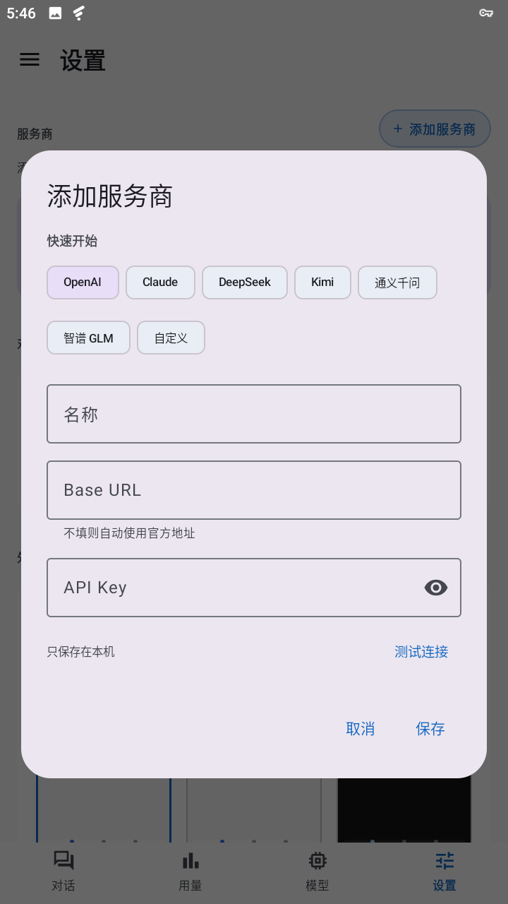
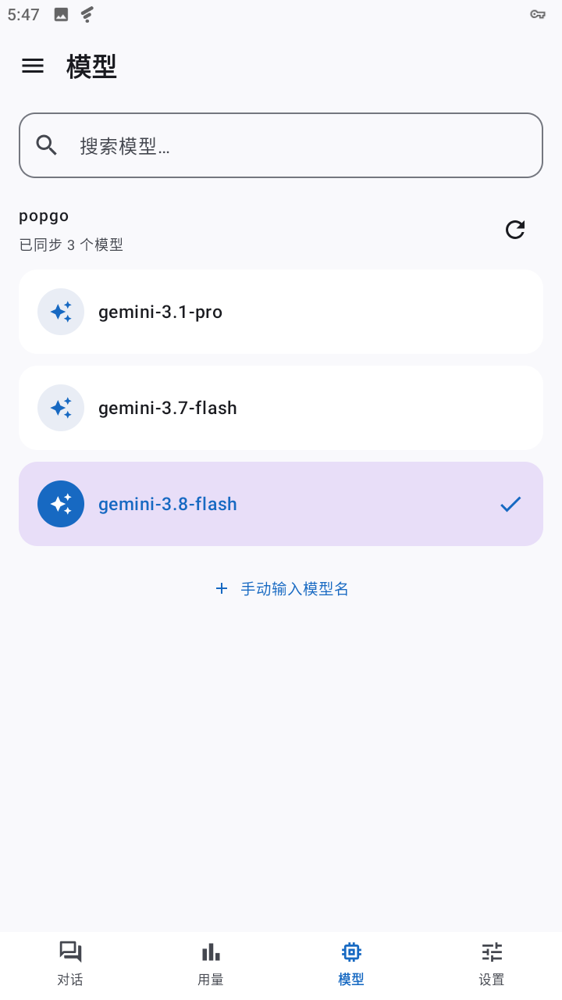
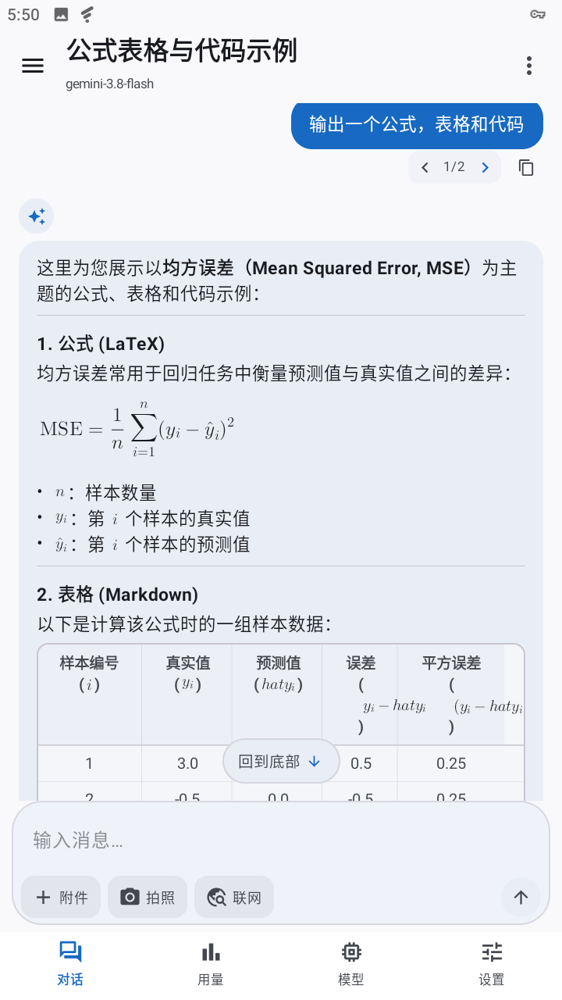
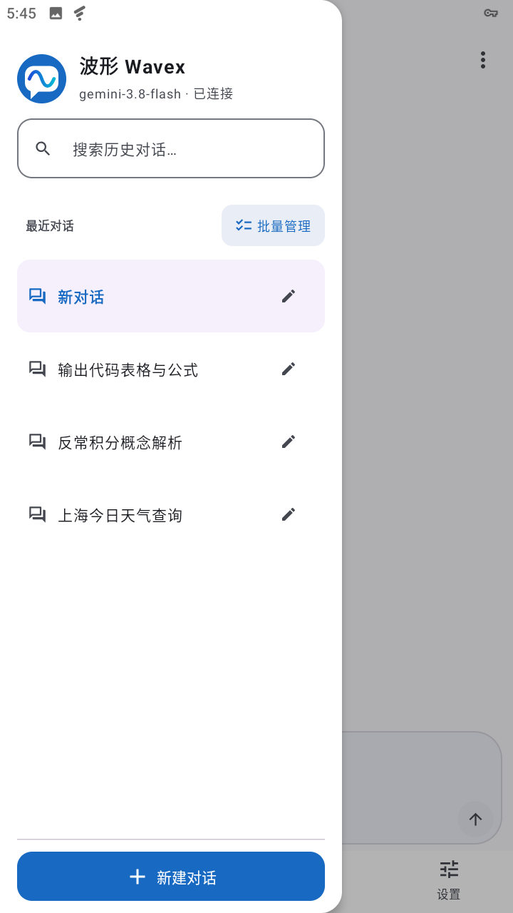
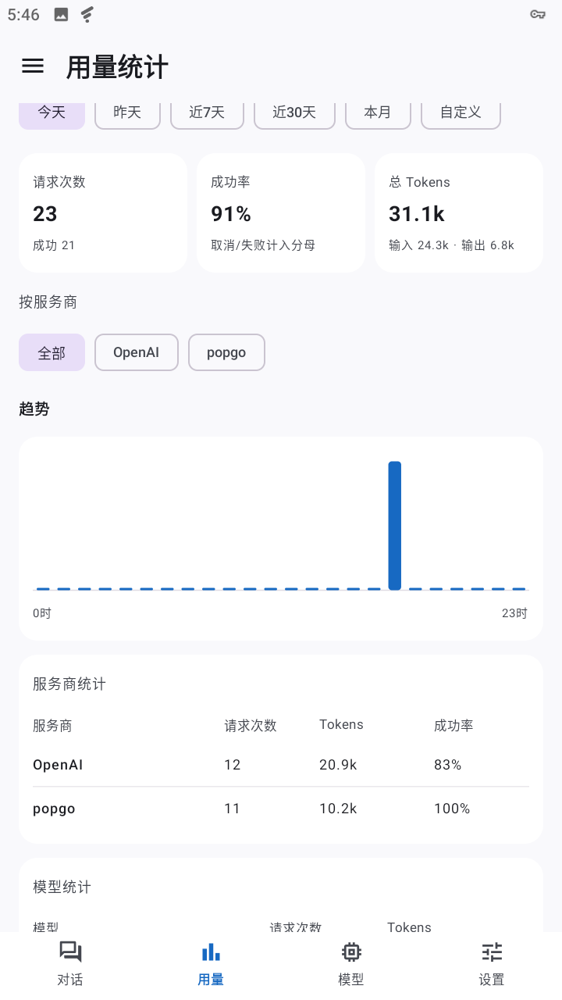

# 波形

**Android 多 AI 服务商客户端**

一个应用接入 OpenAI、Claude、DeepSeek、Kimi 等主流大模型。

[下载](#-下载) · [功能特性](#-功能特性) · [快速上手](#-快速上手)

---

**波形** 把你的大模型服务装进一个 Android 应用：预置主流服务商、也支持任意 OpenAI / Anthropic 兼容接口，多模态输入、流式回复、用量统计一应俱全。密钥加密存储在设备上，对话数据只属于你。

## 📥 下载

[![][download-shield]][release-link]

**需要 Android 8.0 及以上** · 无需注册账号

请始终从 [GitHub Releases][release-link] 获取最新 APK。

## ✨ 功能特性

### 🔌 服务商随心配

- **预置主流服务商** — OpenAI、Claude、DeepSeek、Kimi、通义千问、智谱 GLM，开箱即用
- **自定义接入** — 任意 OpenAI 兼容接口或 Anthropic 兼容网关（中转站），填 Base URL 与密钥即用
- **自动协议适配** — 指向 Anthropic 域名自动切换协议；鉴权方式不匹配时自动回退，不挑中转站
- **连接体检** — 协议、鉴权、模型列表、延迟一次摸清，配置对不对当场见分晓

 &nbsp;

### 💬 对话体验

- **流式回复** — Markdown 与数学公式完整渲染
- **智能降级链** — 模型拒收内容时自动逐层剔除重试（音频 → 图片 → PDF → 思考等级 → 联网搜索），对话不卡死、失败原因不打哑谜
- **自动起标题** — 首轮问答自动命名，随对话演进自动演化；你手动改过的名字永远不被覆盖
- **历史搜索** — 按标题与消息内容找历史，会话再多也不靠翻
- **一键复制** — 回复、错误详情都能复制到剪贴板

 &nbsp;

### 📊 用量统计

- **概览一目了然** — 请求次数、成功率、总 Token 数（输入 / 输出拆分）
- **趋势与日志** — 图表看趋势，调用日志逐条查，支持自定义日期范围

### 🔒 隐私与数据安全

- **密钥加密存储** — API Key 经 Android KeyStore 加密，绝不上传
- **数据留在本地** — 无账号、不追踪，对话只属于你
- **自动备份** — 指定文件夹自动备份全部对话；卸载重装后一键恢复，恢复前自动快照防手滑
- **自由迁移** — 数据随时导出 / 导入

### 🎨 界面

- **深浅色主题** — 跟随系统，切换即生效
- **主题预览卡** — 换主题前先看迷你预览，所见即所得

## 🚀 快速上手

1. **安装** — 从 [发布页][release-link] 下载 APK 并安装
2. **添加服务商** — 打开 **设置 → 服务商**，选预置服务商或自定义接口，粘贴你的密钥；拿不准就用「连接体检」测一下
3. **开始对话** — 在应用内直接发送文字 / 图片 / 文件

## 📄 开源协议

波形基于 [**GNU GPL-3.0**][license-link] 开源，详见 [LICENSE](LICENSE)。

---

**完全开源，免费使用**

[发布页][release-link] · [问题反馈][issues-link] · [许可证][license-link]

<!-- badges & links -->

[release-link]: https://github.com/couldes/wavex/releases
[license-link]: https://www.gnu.org/licenses/gpl-3.0
[issues-link]: https://github.com/couldes/wavex/issues
[download-shield]: https://img.shields.io/badge/%E4%B8%8B%E8%BD%BD-%E8%8E%B7%E5%8F%96%E6%9C%80%E6%96%B0%20APK-2ea44f?style=for-the-badge&logo=github
